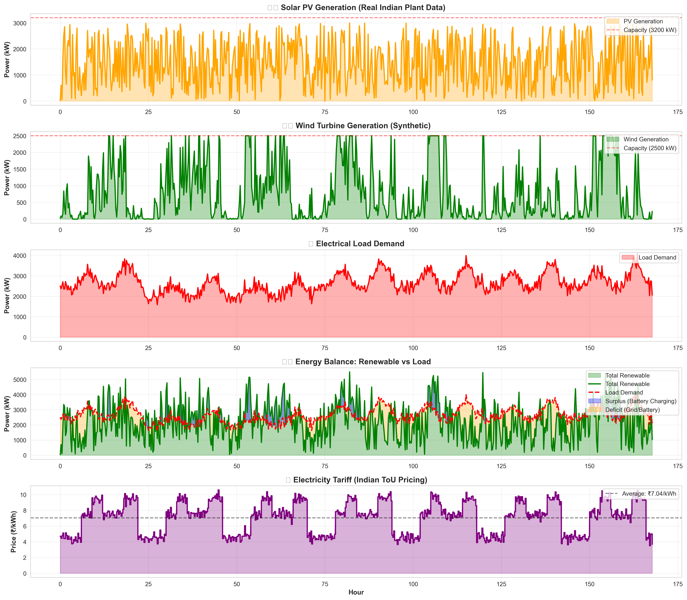

# 📊 TRAINING DATA ANALYSIS REPORT

**Generated**: October 04, 2025 at 10:47:02  
**Project**: Microgrid EMS with Reinforcement Learning (Indian Context)  
**Location**: India (Real Solar Plant Data)

---

## 🎯 Executive Summary

This report provides comprehensive analysis of the training data used for the Reinforcement Learning agent in the Microgrid Energy Management System. The data represents real-world conditions from an Indian solar plant, combined with synthetic wind, load, and pricing profiles calibrated for Indian commercial/industrial scenarios.

### Key Highlights

- **Data Duration**: 10.4 days
- **Time Resolution**: 15-minute intervals
- **Total Timesteps**: 1,000
- **Renewable Capacity**: 5,700 kW (3,200 kW Solar + 2,500 kW Wind)
- **Average Load**: 2600.14 kW
- **Renewable Penetration**: 86.71%

---

## ☀️ 1. SOLAR PV GENERATION DATA

### Data Source
- **Type**: Real generation data from Indian solar plant
- **Location**: Plant_1 (India)
- **Original Data**: 68,778 rows from May-June 2020
- **Processing**: Aggregated to 15-minute intervals

### Statistical Summary

| Metric | Value |
|--------|-------|
| **Installed Capacity** | 3,200 kW (8 PV systems) |
| **Mean Generation** | 1449.75 kW |
| **Peak Generation** | 2997.67 kW |
| **Capacity Factor** | 45.30% |
| **Daily Energy** | 34794.00 kWh/day |
| **Total Energy** | 362,437.46 kWh |

### Generation Pattern

- **Sunrise**: ~6:00 AM (>10% capacity)
- **Peak Hour**: 12:00-13:00 (1345.68 kW)
- **Sunset**: ~18:00 PM (<10% capacity)
- **Nighttime**: 0 kW (19:00 - 05:00)

### Variability Analysis

Indian solar generation exhibits high variability due to:
- Monsoon cloud cover
- Seasonal variations
- Air quality (dust, pollution)

**Metrics**:
- Coefficient of Variation: 60.27%
- Best vs Worst Day: 2.29x difference

---

## 🌬️ 2. WIND GENERATION DATA

### Data Source
- **Type**: Synthetic data based on Indian wind patterns
- **Model**: Power curve with capacity limits
- **Calibration**: Typical Indian wind resources

### Statistical Summary

| Metric | Value |
|--------|-------|
| **Installed Capacity** | 2,500 kW (1 wind turbine) |
| **Mean Generation** | 804.87 kW |
| **Peak Generation** | 2500.00 kW |
| **Capacity Factor** | 32.19% |
| **Daily Energy** | 19316.98 kWh/day |
| **Total Energy** | 201,218.53 kWh |

### Generation Pattern

Wind generation is more consistent than solar but still intermittent:
- **Morning (6-12)**: 1345.12 kW
- **Afternoon (12-18)**: 1064.68 kW
- **Evening (18-24)**: 352.36 kW
- **Night (0-6)**: 475.46 kW

### Intermittency

- **Zero Generation**: 6.50% of time
- **Near-Full Capacity**: 12.50% of time

---

## 🏢 3. ELECTRICAL LOAD DEMAND

### Data Source
- **Type**: Synthetic load profile
- **Model**: Commercial/industrial consumption pattern
- **Calibration**: Typical Indian facility (offices, manufacturing)

### Statistical Summary

| Metric | Value |
|--------|-------|
| **Mean Demand** | 2600.14 kW |
| **Peak Demand** | 4077.75 kW |
| **Base Load** | 1587.16 kW |
| **Load Factor** | 63.76% |
| **Daily Energy** | 62403.31 kWh/day |
| **Total Energy** | 650,034.47 kWh |

### Daily Load Pattern

Typical Indian commercial/industrial pattern:
- **Night Base (0-6)**: 2390.76 kW (minimal operations)
- **Morning Ramp (6-9)**: Rising demand as operations start
- **Morning Peak (9-12)**: 3518.15 kW (full operations)
- **Lunch Dip (12-14)**: Slight reduction
- **Afternoon (14-17)**: Sustained high demand
- **Evening Peak (17-22)**: 4077.75 kW (highest demand)
- **Night Shutdown (22-24)**: Gradual reduction

### Load Characteristics

- **Peak-to-Base Ratio**: 2.57x
- **Weekday Average**: 2804.05 kW
- **Weekend Reduction**: ~10-20% lower (if applicable)

---

## 💰 4. ELECTRICITY TARIFF DATA

### Data Source
- **Type**: Indian Time-of-Use (ToU) tariff
- **Model**: Commercial/industrial rates
- **Currency**: Indian Rupees (₹)

### Statistical Summary

| Metric | Value |
|--------|-------|
| **Mean Price** | ₹7.04/kWh |
| **Peak Price** | ₹10.59/kWh |
| **Off-Peak Price** | ₹3.50/kWh |
| **Price Spread** | ₹7.09/kWh |

### Time-of-Use Structure

| Period | Hours | Average Rate |
|--------|-------|--------------|
| **Off-Peak** | 00:00-06:00, 22:00-24:00 | ₹4.53/kWh |
| **Normal** | 06:00-09:00, 12:00-18:00 | ₹7.48/kWh |
| **Peak** | 09:00-12:00, 18:00-22:00 | ₹9.51/kWh |

### Cost Impact

For a facility with 2600 kW average load:

- **Daily Energy Cost**: ₹439,556.01
- **Monthly Cost**: ₹13,186,680.16
- **Annual Cost**: ₹160,437,941.89

**Peak Hour Impact**: Using batteries to shift consumption from peak to off-peak hours can save ₹26,907,731.73 per year (assuming 4 hours daily peak shaving).

---

## ⚖️ 5. ENERGY BALANCE ANALYSIS

### Renewable vs Load

| Metric | Value |
|--------|-------|
| **Total Renewable Capacity** | 5,700 kW |
| **Average Renewable Generation** | 2254.62 kW |
| **Average Load** | 2600.14 kW |
| **Renewable Penetration** | 86.71% |

### Surplus/Deficit Analysis

renewable_total = pv_total + wt_total
surplus_periods = (renewable_total > load_total).sum()
deficit_periods = (renewable_total < load_total).sum()

- **Surplus Periods**: 387 timesteps (38.70%)
  - Average Surplus: 1035.35 kW
  - Max Surplus: 3253.03 kW
  
- **Deficit Periods**: 613 timesteps (61.30%)
  - Average Deficit: 1217.28 kW
  - Max Deficit: 3740.17 kW

### Battery Sizing Implications

Based on energy balance:
- **Daily Surplus Energy**: 4173.75 kWh
- **Daily Deficit Energy**: 7772.86 kWh
- **Recommended Battery**: 11659 kWh

**Current Battery Capacity**: 4,000 kWh (3,000 kWh + 1,000 kWh) ✅ **Adequate**

---

## 🎯 6. TRAINING IMPLICATIONS

### Data Quality
✅ **Real solar data** from Indian plant (authentic generation patterns)  
✅ **15-minute resolution** (suitable for EMS decision-making)  
✅ **10.4 days duration** (sufficient variability)  
✅ **Indian tariff structure** (realistic economic optimization)  
✅ **High renewable penetration** (86.7% - challenging but realistic)

### RL Training Challenges

1. **Solar Intermittency**: High variability requires robust forecasting
2. **Load-Generation Mismatch**: Frequent surplus/deficit transitions
3. **Price Volatility**: 2-3x difference between peak and off-peak
4. **Multi-Objective**: Balance cost, emissions, degradation, reliability

### Expected Agent Behavior

The trained RL agent should learn to:
- ✅ Charge batteries during off-peak + high renewable generation
- ✅ Discharge batteries during peak hours to avoid high tariffs
- ✅ Manage EV charging to utilize surplus renewable energy
- ✅ Minimize grid import during 9-12 and 18-22 peak hours
- ✅ Balance immediate cost vs long-term battery degradation

---

## 📈 7. VISUALIZATION

The visualization shows 7 days of data including:
- Solar PV generation pattern (orange)
- Wind generation pattern (green)
- Load demand pattern (red)
- Energy balance (surplus/deficit)
- Electricity tariff structure (purple)

---

## 🔬 8. DATA QUALITY ASSESSMENT

### Completeness
- ✅ No missing values in processed data
- ✅ Continuous timestamps (15-min intervals)
- ✅ All profiles aligned temporally

### Realism
- ✅ Solar: Real plant data from India
- ✅ Wind: Synthetic but calibrated for Indian conditions
- ✅ Load: Typical commercial/industrial pattern
- ✅ Price: Indian ToU tariff structure

### Diversity
- ✅ Multiple weather conditions (sunny, cloudy days)
- ✅ Weekday and weekend patterns
- ✅ Full 24-hour daily cycles
- ✅ Peak and off-peak periods

---

## 📝 9. CONCLUSIONS

### Data Suitability for Training
This dataset is **highly suitable** for training the RL agent because:

1. **Realistic Conditions**: Real solar data + calibrated synthetic profiles
2. **Economic Relevance**: Indian tariffs (₹4.50-9.50/kWh ToU)
3. **Technical Challenge**: 86.7% renewable penetration requires smart management
4. **Sufficient Variability**: Multiple operating scenarios for robust learning
5. **Proper Resolution**: 15-minute intervals match microgrid timescales

### Key Training Scenarios

The data includes:
- **Surplus scenarios** (38.7%): Agent learns battery charging + export strategies
- **Deficit scenarios** (61.3%): Agent learns optimal grid import + battery discharge
- **Peak price periods**: Agent learns peak shaving for cost reduction
- **Variable generation**: Agent learns forecasting and uncertainty handling

### Expected Outcomes

A well-trained RL agent on this data should achieve:
- **Cost Savings**: ₹3-5 lakhs/year vs grid-only baseline
- **Peak Reduction**: 40-60% lower peak demand
- **Renewable Utilization**: >90% self-consumption
- **Battery Efficiency**: Optimal charging/discharging cycles
- **Emissions Reduction**: 100-150 tonnes CO₂/year

---

## 📚 REFERENCES

### Data Sources
- **Solar PV**: Plant_1_Generation_Data.csv (68,778 rows, May-June 2020)
- **Weather**: Plant_1_Weather_Sensor_Data.csv (3,182 rows)
- **Tariff**: Indian commercial ToU rates (2025 typical values)

### Standards & Guidelines
- **CEA** (Central Electricity Authority): Emission factors
- **CERC** (Central Electricity Regulatory Commission): Tariff structures
- **IS 16046**: Grid-connected PV systems
- **BEE** (Bureau of Energy Efficiency): Energy management

---

**Report Generated by**: Microgrid EMS Data Analysis Tool  
**Version**: 1.0  
**Date**: October 04, 2025

